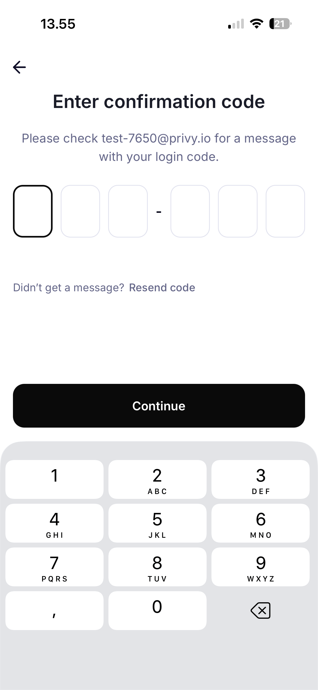
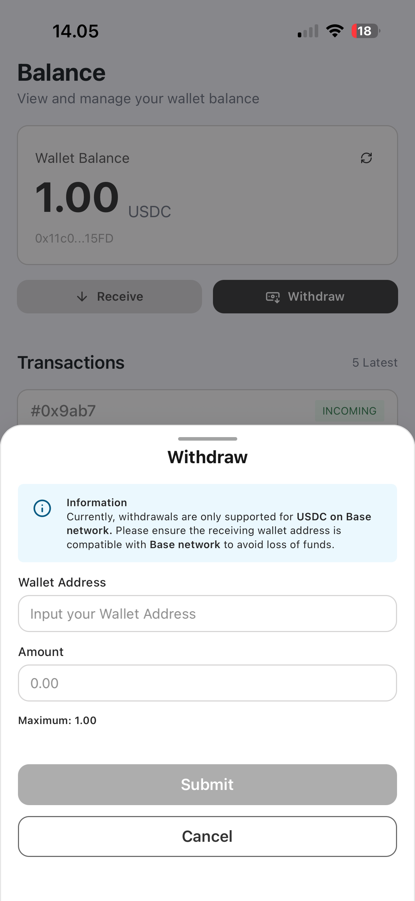

# Rozo App Support

Welcome to Rozo App Support! This page provides resources and information to help you get the most out of the Rozo app.

## Contact Information

We're here to help! Reach out to us through any of the following channels:

- **Email**: [hi@rozo.ai](mailto:hi@rozo.ai)
- **Contact Form**: [Submit a Support Request](https://forms.gle/iRcUc44a3Pzj2KpP7)
- **X (Twitter)**: [@rozoai](https://x.com/rozoai)
- **Discord**: [Join our Discord Community](https://discord.com/invite/EfWejgTbuU)
- **GitHub**: [Rozo on GitHub](https://github.com/rozoai)

---

## Guides & Tutorials

### Getting Started with Rozo App

#### 1. Registration

**Step 1: Download the App**

- Download Rozo from the App Store
- Open the app on your device

**Step 2: Sign in with Privy**

- Tap "Sign In" on the welcome screen
- Enter your email to receive a one-time passcode (OTP)
- Enter the 6-digit OTP to verify your email

**Step 3: Create or Connect Your Wallet**

- After verifying, Rozo will provision a secure embedded wallet via Privy automatically
- Optionally, connect an external wallet (e.g., using WalletConnect) if you prefer

| Welcome                                              | Enter Email                                              | Enter OTP                                              |
| ---------------------------------------------------- | -------------------------------------------------------- | ------------------------------------------------------ |
|  |  |  |

---

#### 2. Depositing Funds

**Step 1: Navigate to Balance**

- Open the app and tap "Balance" on the home screen
- Select the asset you want to deposit

**Step 2: Tap Receive**

- Tap the "Receive" button for the selected asset

**Step 3: Enter Deposit Amount**

- Input the amount you intend to deposit
- Review any displayed minimums or limits

**Step 4: Scan QR or Use Payment Link**

- Scan the displayed QR code with your external wallet
- Or tap/copy the "Payment" link to open in a compatible wallet

**Step 5: Choose Deposit Method**

- Select your preferred method (e.g., on-chain transfer, supported rails)
- Follow the prompts in your wallet to complete the payment

**Confirmation**

- You'll receive a notification when funds arrive
- Check your updated balance in the wallet section

| Balance                                         | Enter Amount                                         | QR / Payment Link                                          | Choose Method                                         |
| ----------------------------------------------- | ---------------------------------------------------- | ---------------------------------------------------------- | ----------------------------------------------------- |
|  |  |  |  |

**Important Notes:**

- Always double-check the network before sending
- Minimum deposit amounts may apply
- Network fees are paid separately from your deposit amount

---

#### 3. Withdrawing Funds

**Step 1: Open Balance**

- Go to the "Balance" page in the app

**Step 2: Tap Withdraw**

- Tap the "Withdraw" button for the asset you want to send out

**Step 3: Enter Withdrawal Details**

- Input the destination wallet address
- Enter the amount to withdraw
- Confirm to submit the withdrawal

| Balance                                          | Withdraw Modal                                    |
| ------------------------------------------------ | ------------------------------------------------- |
|  |  |

**Security Tips:**

- Always verify the destination address
- Start with a small test transaction for new addresses
- Ensure the destination address supports the Base network before sending

---

#### 4. Making Payments

**Step 1: Initiate Payment**

- Tap "Pay" or scan a merchant QR code
- Enter the payment amount

**Step 2: Select Payment Method**

- Choose which stablecoin to use
- The app automatically finds the best route
- Review the exchange rate and fees

**Step 3: Confirm Transaction**

- Review payment details
- Tap "Confirm Payment"
- Transaction completes in seconds

---

## Frequently Asked Questions (FAQs)

### 1. What is the Rozo App?

Rozo is a stablecoin wallet and payment app that makes it easy to self manage your assets. With Rozo, you can seamlessly manage multiple stablecoins across different blockchains without worrying about complex technical details.

### 2. How do I register for a Rozo account?

Getting started is quick with Privy (Email + OTP only):

- Download the app from the App Store
- Tap "Continue", enter your email, and request a one-time passcode (OTP)
- Enter the 6-digit OTP to verify your email
- Your secure embedded wallet is created automatically via Privy
- Optionally connect an external wallet and enable biometric lock

Takes about 1–2 minutes.

### 3. What cryptocurrencies can I deposit?

Rozo currently supports popular stablecoins including:

- USDC (USD Coin).
- Additional tokens coming soon

You can deposit these on multiple networks including Base and Stellar

### 4. How long does a deposit take?

Deposit times vary by network:

- **Fast networks** (Base, Stellar): 2-5 seconds

You'll receive a notification as soon as your deposit is confirmed.

### 5. Are there any fees for deposits?

Rozo does not charge fees for deposits. However, you'll need to pay the blockchain network fee (gas fee) when sending from your external wallet. These fees vary by network and are paid to blockchain validators, not to Rozo.

### 6. How do I withdraw funds from my Rozo wallet?

To withdraw:

1. Tap "Withdraw" in the app
2. Select the asset and network
3. Enter the destination address and amount
4. Review and confirm the transaction
5. Complete 2FA verification if enabled

Withdrawals typically process within 2-5 seconds.
ncel" if the option is available.

### 7. What should I do if I sent funds to the wrong address?

Unfortunately, blockchain transactions are irreversible. If you sent funds to an incorrect address:

- Double-check the transaction on a blockchain explorer
- If you control the destination wallet, you can access the funds there
- If it was sent to someone else's address, contact them directly
- Contact our support team for guidance

Always verify addresses before confirming transactions!

### 8. Can I use Rozo in my country?

Rozo is available in most countries worldwide. However, we cannot provide services to residents of certain restricted jurisdictions due to regulatory requirements.

### 15. How do I contact customer support?

You can reach us through:

- **Support Form**: [forms.gle/iRcUc44a3Pzj2KpP7](https://forms.gle/iRcUc44a3Pzj2KpP7)
- **Email**: hi@rozo.ai

We typically respond within 24 hours (often much faster!).

---

## Still Need Help?

If you couldn't find the answer to your question, please don't hesitate to reach out:

**Submit a Support Ticket**: [https://forms.gle/iRcUc44a3Pzj2KpP7](https://forms.gle/iRcUc44a3Pzj2KpP7)

**Email Us**: [hi@rozo.ai](mailto:hi@rozo.ai)

**Join Our Community**: Connect with other Rozo users on [Discord](https://discord.com/invite/EfWejgTbuU) or follow us on [X](https://twitter.com/rozoai)
