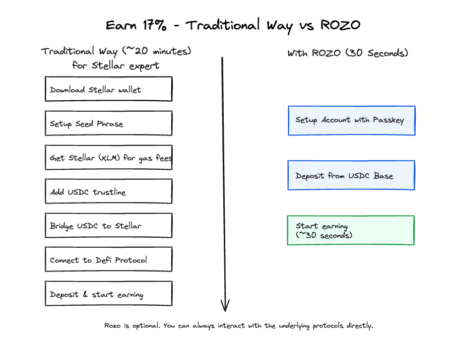

# Intent Based Earn

Earn yield across chains. No need to understand the underlying blockchains or manage multiple wallets.

<figure><figcaption></figcaption></figure>

***

## FAQ 

* [1. Is this high yield on some shitcoin?](intent-based-earn.md#faq-1)
* [2. What is Stellar blockchain?](intent-based-earn.md#faq-2)
* [3. Why can I get 16% APY?](intent-based-earn.md#faq-3)
* [4. Where does the high yield come from?](intent-based-earn.md#faq-4)
* [5. Why does Blend show 15%, but the ROZO says 17%?](intent-based-earn.md#faq-5)
* [6. Are there risks?](intent-based-earn.md#faq-6)
* [7. Can I use other wallets?](intent-based-earn.md#faq-7)
* [8. How do I backup my Rozo wallet?](intent-based-earn.md#faq-8)
* [9. What does Rozo wallet actually do for me?](intent-based-earn.md#faq-9)
* [10. Where is my money saved?](intent-based-earn.md#faq-10)
* [11. Is this non-custodial?](intent-based-earn.md#faq-11)
* [12. My USDC is on Base/Solana — how can I earn Stellar yields?](intent-based-earn.md#faq-12)
* [13. What are the deposit limits and confirmation time?](intent-based-earn.md#faq-13)
* [14. What is ROZO?](intent-based-earn.md#faq-14)

***

### 1. Is this high yield (16%+) on some shitcoin? 

**No.** The yield is on [**USDC**](https://coinmarketcap.com/currencies/usd-coin/) — the regulated stablecoin issued by Circle with over **$75B** in circulation (Jan 2026).

* USDC is 1:1 backed by US dollars and US treasuries
* Issued by Circle, a regulated financial institution
* Native USDC on **Stellar**, not bridged or wrapped ([Contract Addresses](https://developers.circle.com/stablecoins/usdc-contract-addresses))

You're earning yield on one of the most trusted stablecoins in crypto, not a speculative token.

***

### 2. What is Stellar blockchain? 

[**Stellar**](https://coinmarketcap.com/currencies/stellar/) is a Layer 1 blockchain focused on payments. Stellar has been operating since 2014.

* Comparable in scale and adoption to networks such as Avalanche, Sui, TON, Arbitrum, and Polygon
* Designed for fast, low-cost payments
* Native USDC is issued directly by Circle on Stellar

***

### 3. Why can I get 16% APY? Is this real? 

**Yes, it's real.** This is not "TVL subsidy farming". It's a structural supply and demand result:

1. **Large XLM holder base** on Stellar network
2. **Relative scarcity of native USDC** on Stellar
3. **Strong borrowing demand** for USDC (for payments, liquidity needs)

This naturally pushes USDC lending rates higher than on chains where stablecoins are abundant.

***

### 4. Where does the high yield (12%+) come from? 

ROZO Earn itself **does not generate yield**.

Current Earn yield source:

**Blend Protocol** — the #1 DeFi protocol on Stellar (Soroban)

* Stablecoin lending market
* Current APY: \~12-17%
* 7-day / 30-day historical yields in similar range
* Yields generated from **real borrowing demand**
* TVL: **\~$78M** ([DefiLlama](https://defillama.com/protocol/blend))
* Audited by **Certora** and **Code4rena**
* Active bug bounty program (up to 2M BLND)
* [Audit Reports](https://docs.blend.capital/audits-and-bug-bounties) | [Docs](https://docs.blend.capital/) | [Dune Dashboard](https://dune.com/scoffie/stellar)

Rozo does not modify or interfere with Blend's core logic.

***

### 5. Why does Blend show 15%, but ROZO says 17%? 

Blend rewards lenders with **BLND tokens** in addition to the base interest rate.

We use **DeFindex** for auto-compounding — it automatically sells BLND tokens and reinvests into USDC, boosting your effective APY.

**DeFindex** provides:

* Auto-compounding (sells BLND → USDC)
* Automatic settlement
* Reduced manual operations

DeFindex uses Blend as its underlying yield source and has completed security audits.

* Audited by **OtterSec**
* [Audit Report (PDF)](https://github.com/paltalabs/defindex/blob/main/audits/2025_03_18_ottersec_defindex_audit.pdf) | [Docs](https://docs.defindex.io/)
* [Auto-compound Vault Contract](https://stellar.expert/explorer/public/contract/CBNKCU3HGFKHFOF7JTGXQCNKE3G3DXS5RDBQUKQMIIECYKXPIOUGB2S3)

***

### 6. Are there risks? 

**Yes.** Using any financial application involves risk. Rozo does not promise fixed returns and does not hide risks.

**Smart Contract Risk**

Blend and DeFindex function using smart contracts. If a bug is discovered and exploited, it could result in a loss of user funds. To mitigate this:

* Blend Protocol audited by [Certora and Code4rena](https://docs.blend.capital/audits-and-bug-bounties)
* DeFindex audited by [OtterSec](https://github.com/paltalabs/defindex/blob/main/audits/2025_03_18_ottersec_defindex_audit.pdf)

**Oracle Risk**

Blend's lending pools rely on oracles to price assets accurately. If a pool's oracle stopped functioning, users could suffer a loss of funds.

**Asset Risk**

Lenders using Blend are exposed to asset risk. High volatility in assets could cause the pool to take on bad debt. Lenders could suffer asset loss if bad debt exceeds the value of assets backstopping the pool.

**Stellar Protocol Risk**

As with all decentralized ledgers, Stellar has its unique set of risks. Learn more about the [Stellar Consensus Protocol](https://developers.stellar.org/docs/learn/fundamentals/stellar-consensus-protocol).

**Cross-Chain / Bridge Risk**

We use battle-tested cross-chain infrastructure:

* [**CCTP**](https://www.circle.com/en/cross-chain-transfer-protocol) (Circle Cross-Chain Transfer Protocol) — operated by Circle, uses native mint/burn (no wrapped tokens)
* [**NEAR Intents**](https://near.org/intents) — processed **$8B+** in cross-chain volume (as of Jan 2025)
* [**Across**](https://across.to/) — intent-based bridge with optimistic verification

While these are established protocols, cross-chain operations still carry inherent risks including network delays and potential smart contract vulnerabilities.

**Interest Rate Fluctuation**

APY is variable and depends on market supply and demand. Rates can go up or down.

***

### 7. Can I use other wallets? 

**Yes.** Besides [ROZO Earn](https://earn.rozo.ai), you can use any Stellar wallet to interact with the underlying protocols directly:

* [Lobstr](https://lobstr.co/)
* [Freighter](https://www.freighter.app/)
* [Beans](https://www.beansapp.com/)
* [Meru](https://meru.finance/)

**Without Rozo, you would need to:**

1. Download a new Stellar wallet app
2. Write down your seed phrase / backup keys
3. Get XLM for Stellar network fees
4. Add USDC trustline to your Stellar wallet
5. Bridge USDC from Base/Solana to Stellar
6. Connect wallet to Blend/DeFindex
7. Deposit and start earning

**With Rozo:** Start earning in 30 seconds. We handle all of the above automatically.

***

### 8. How do I backup my Rozo wallet? 

Rozo wallet uses **Passkeys** for authentication. Your passkey is automatically synced and backed up by your device/platform:

* **Apple devices**: Synced via iCloud Keychain
* **Android devices**: Synced via Google Password Manager
* **Desktop browsers**: Synced via your browser's password manager (Chrome, Safari, etc.)

As long as your passkey is saved to your device's password manager, you can recover access on any device signed into the same account.

***

### 9. What does Rozo wallet actually do for me? 

Rozo wallet abstracts complex operations **without changing asset ownership**:

| Without Rozo                                           | With Rozo                      |
| ------------------------------------------------------ | ------------------------------ |
| Learn about Stellar                                    | One-click deposit              |
| Create Stellar wallet                                  | Automatic cross-chain          |
| Handle Stellar asset model (Trustlines, Asset Issuers) | Automatic protocol interaction |
| Manual cross-chain bridging                            | Automatic yield earning        |
| Manual deposit to Blend Protocol                       |                                |
| Handle Blend tokens, compounding, selling              |                                |

***

### 10. Where is my money saved? Is it on your centralized server? 

**No.** Your funds are **self-custodial** — stored in a smart contract wallet on Stellar, not on any Rozo server.

We use smart contract wallets powered by [OpenZeppelin Stellar Contracts](https://github.com/OpenZeppelin/stellar-contracts):

* Your wallet is a **smart contract on Stellar blockchain**
* Only you can authorize transactions via your Passkey
* Rozo cannot access, move, or freeze your funds
* All transactions are verifiable on-chain

This is the same security model used by leading smart wallets in the industry.

***

### 11. Is this non-custodial? 

**Yes.**

* Users always use their own authorized signatures
* Rozo cannot unilaterally initiate transfers
* Rozo does not hold private keys or control funds

Rozo's role is an **operation coordinator**, not a **fund controller**.

***

### 12. My USDC is on Base/Solana — how can I earn Stellar yields? 

This is the core abstraction layer Rozo provides. You don't need to manually bridge anything.

**How it works:**

1. You deposit USDC from Base, Solana, or any supported chain
2. Rozo automatically bridges your USDC to Stellar using **CCTP** (Circle Cross-Chain Transfer Protocol)
3. Your USDC is deposited into Blend Protocol via DeFindex
4. You start earning yield immediately

**How does the bridging work?**

We use [**CCTP**](https://www.circle.com/en/cross-chain-transfer-protocol) — Circle's official cross-chain protocol for USDC:

* USDC is **burned** on the source chain (e.g., Base)
* USDC is **minted** on the destination chain (Stellar)
* This is **native USDC** on both sides — no wrapped tokens, no bridge risk from third-party liquidity pools
* Circle guarantees 1:1 redemption

**When you withdraw:**

The reverse happens — USDC is burned on Stellar and minted on your destination chain.

**Supported infrastructure:**

* **CCTP** (Circle Cross-Chain Transfer Protocol) — primary bridge for USDC
* **Across** — additional cross-chain support
* **NEAR Intents** — intent-based routing

All bridging is handled automatically. You just deposit and withdraw.

***

### 13. What are the deposit limits and confirmation time? 

**During Beta:**

|                 | Amount         |
| --------------- | -------------- |
| Minimum deposit | **0.5 USDC**   |
| Maximum deposit | **3,000 USDC** |

**Confirmation time:**

* Most deposits confirm within **\~30 seconds**
* Larger amounts may take a few more minutes
* We're continuously improving speed (faster processing coming mid-Jan 2025)

***

### 14. What is ROZO? 

**ROZO promotes economic freedom.**

We build infrastructure that lets anyone earn yield and make payments — without needing to understand complex blockchain systems.

**Long-term focus:**

* **PayFi** (Pay to Earn) — Assets used for payments can continuously generate yield

**Supported by:**

* [Stellar Community Fund](https://x.com/StellarOrg/status/2001332873937457395)
* [Base Grants](https://www.coinbase.com/developer-platform/discover/launches/summer-builder-grants)
* [Draper Founder Residency](https://x.com/draper_u/status/1940908242412183926)
* [Circle Alliance](https://partners.circle.com/partner/rozo)

**Try ROZO:**

* [ROZO Earn](https://earn.rozo.ai) — Earn yield on USDC&#x20;
* [ROZO Bridge](https://intents.rozo.ai/bridge) — Intent based bridge

***

## Start now

https://earn.rozo.ai
