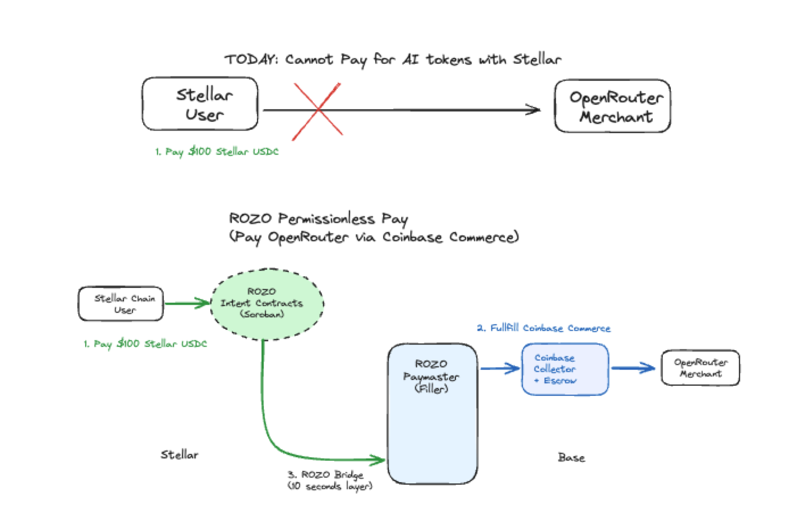

# ROZO Intents — Technical Architecture Document


## 1. Summary

Today, Stellar users cannot easily pay for AI tokens — there is no direct path from Stellar USDC to OpenRouter, Claude, Gemini, ChatGPT, or other AI providers. Users have to bridge to another chain, swap to another asset, and figure out the destination provider's checkout themselves. This is the friction ROZO Intents removes.

ROZO Intents is a permissionless payment layer that lets Stellar USDC users pay for any AI service tokens of Claude (Anthropic), Gemini (Google), ChatGPT (OpenAI) via OpenRouter, and 485+ other agentic-economy services on Tempo and adjacent networks — without leaving the Stellar ecosystem and without any AI provider needing to integrate Stellar.

The system extends ROZO's Stablecoin Abstraction API (Hacken-audited with 1,032 users, $7.39M+ volume on Stellar) with three new components:

- Hacken security audit: https://hacken.io/audits/rozo/sca-rozo-sdf-audit-mar2026/
- Dune dashboard (live): https://dune.com/rozointents/stellar


1. Intent Extraction Layer — parses AI provider invoices/checkout flows into a structured Stellar payment intent
2. Settlement Adapter — translates a Stellar USDC payment into a Coinbase-Commerce-acceptable USDC settlement on the destination chain (no provider-side change)
3. Rewards — a utility cashback issued to users, redeemable on the next purchase, funded by AI-provider referral commissions

All of it runs on Stellar mainnet. No provider partnership required. No bridge for the user to operate.

---

## 2. System Architecture



### 2.1 Component Overview

```
  Stellar User (LOBSTR / Freighter / StellarExpert)
        │  paste invoice URL  /  natural-language ("buy $100 OpenRouter")
        ▼
  ROZO Intents UI  ──►  Intent Extraction Layer (NEW)
                              │  user signs once
                              ▼
                    Stablecoin Abstraction API (existing)
                              │
                              ▼
                    Settlement Adapter (NEW)
                              │
                ┌─────────────┴──────────────┐
                ▼                            ▼
       AI provider credited         Rewards Issuer (NEW)
       via Coinbase Commerce        cashback to user
```

### 2.2 What's Completed vs. What's New

| Component | Status |
|---|---|
| Stablecoin Abstraction API (Stellar↔Base sub-second settlement) | ✅ Production, Hacken-audited |
| Soroban PayIn / PayOut contracts | ✅ Production |
| Passkey C-address wallet | ✅ Production |
| Solver / liquidity routing | ✅ Production |
| Public Dune dashboard + Hacken audit report | ✅ Live |
| Wallet + ecosystem partners shipped (LOBSTR, Freighter, StellarExpert; Mykobo, Defindex, Soroswap) | ✅ Live |
| Intent Extraction Layer | 🆕 To build |
| Settlement Adapter (Coinbase Commerce path) | 🆕 To build |
| On-chain Rewards token + redemption flow | 🆕 To build |
| Wallet-embedded AI purchase flow (LOBSTR, Freighter, +) | 🆕 To build |

The grant funds three components, not the whole stack. Most of the heavy lifting (cross-chain settlement, audit, partner network) is already in production.

---

## 3. Why This Architecture Is Permissionless

The unlock: OpenRouter and most AI providers already accept crypto via Coinbase Commerce. Their checkout flow exposes a payable address + amount + memo on a chain Coinbase Commerce supports. They don't care who pays or how, as long as the funds settle.

That means ROZO never needs:
- An OpenRouter / Anthropic / OpenAI partnership
- An API key from the AI provider
- The provider to integrate the Stellar SDK
- The provider to know that Stellar is involved

What ROZO does:
- Parse the public Coinbase Commerce checkout (or the invoice URL the user pastes) into a structured intent
- On the Stellar side, take USDC from the user
- On the destination side (Base, ETH, etc.), settle the matching amount to Coinbase Commerce's endpoint
- Confirm settlement back to the user, deliver Rewards

Two practical consequences:
- Tranche 1 timeline is credible — no third-party engineering bandwidth or contract negotiation gates the delivery
- The integration scales horizontally — every new AI service that accepts Coinbase Commerce becomes payable from Stellar without new provider work

---

## 4. Detailed Component Design

### 4.1 Intent Extraction Layer

Job: Take whatever the user gives us (an OpenRouter invoice URL, a natural-language request, an AI-provider checkout link) and produce a verified, structured `PaymentIntent`.

`PaymentIntent` schema:

```typescript
interface PaymentIntent {
  source: { chain: "stellar"; asset: "USDC"; account: StellarAddress };
  destination: {
    provider: "openrouter" | "anthropic" | "openai" | string;
    chain: "base" | "ethereum" | string;
    asset: "USDC";
    address: EVMAddress;
    amount: BigInt;          // smallest unit
    memo?: string;           // Coinbase Commerce reference id, if present
    expiresAt: ISOString;
  };
  metadata: {
    invoiceUrl?: string;
    extractedFrom: "url-paste" | "natural-language" | "wallet-deeplink";
    aiServiceCredit: { type: "credit"; amountUsd: number };
    rewardsBps: number;       // basis points cashback at time of intent
  };
  validation: {
    providerAllowlisted: boolean;
    coinbaseCommerceVerified: boolean;
    amountSanityCheck: boolean;
  };
}
```

Extraction sources:

1. OpenRouter invoice URL paste. OpenRouter's checkout exposes a Coinbase Commerce charge object with `pricing.local`, `addresses.{chain}`, and `memo`/`code`. We fetch the public Coinbase Commerce charge by its ID, extract destination + amount + memo, and verify the charge is in `NEW` status.

2. Natural-language ("buy $100 of OpenRouter credit"). A small LLM-assisted parser maps the request to a known provider's top-up flow, then uses that provider's official top-up endpoint (which exposes a Coinbase Commerce charge for direct top-ups on supported providers) to get the structured intent. The parsed intent is *always* shown to the user for confirmation before any signing — the LLM never signs.

3. Wallet deeplink. Partner wallets (LOBSTR, Freighter) embed a ROZO SDK that constructs the intent client-side from a structured payload, no parsing needed.

Provider allowlist + sanity checks:
- An allowlist of known AI provider addresses on Coinbase Commerce (OpenRouter, Anthropic, OpenAI, etc.) — hash-pinned, updated via a signed config
- Amount sanity check: warn if the parsed amount exceeds a configurable per-tx ceiling (default: $1,000) — user explicit re-confirm
- Charge status check: only `NEW` charges accepted; `EXPIRED` / `CANCELED` rejected with clear error
- Memo preservation: Coinbase Commerce uses memo / `code` for charge correlation — preserved end-to-end

Failure modes handled:
- Charge expired between paste and signing → re-fetch + re-display + require re-confirm
- Provider returns 4xx → user sees structured error + option to retry
- LLM mis-parses → confirmation step exposes the structured intent for human review before signing
- User edits parsed amount → treated as new intent, requires fresh re-confirm

### 4.2 Settlement Adapter

Job: After the user signs once on Stellar, deliver USDC to the AI provider's Coinbase Commerce endpoint on the destination chain, exact amount + memo, fast.

Flow:

```
1. User signs Stellar tx → USDC locked in Soroban PayIn contract (Stellar mainnet)
2. ROZO solver picks up the locked intent (existing #38 pipeline)
3. Solver dispatches USDC from its destination-chain liquidity pool to the
   Coinbase Commerce target address on Base / Ethereum
4. Solver attaches the exact memo / code from the parsed Coinbase Commerce charge
5. Coinbase Commerce confirms the charge as PAID → webhook (or on-chain confirmation)
6. ROZO marks intent settled → AI provider credits the user's account
   (this step is provider-side and standard Coinbase Commerce behavior)
7. ROZO mints Rewards token on Stellar to the user's wallet
8. ROZO releases its locked liquidity / rebalances (existing #38 mechanism)
```

Settlement speed: Sub-second on the Stellar → solver leg (existing #38 SLA — 95% < 10s end-to-end including destination-chain confirmation). The destination-chain confirmation is the dominant latency.

Liquidity: Reuses the existing #38 solver liquidity pool (LP capital pool already contributed to Stellar ecosystem). No new liquidity needed for Tranche 1 / 2.

Settlement risk model:
- ROZO is exposed between locking on Stellar (instant) and Coinbase Commerce confirmation (seconds-to-minutes on EVM destination)
- Same risk model as #38; Hacken-audited
- Per-tx ceiling + circuit breaker on aggregate per-window outflow (existing #38 infra)

### 4.3 On-Chain Rewards Token

Asset: Stellar-native asset issued by a Soroban contract. Not a Soroban token contract — a Stellar Classic asset with a Soroban-controlled issuer for programmatic mint/burn. This keeps it natively visible in every Stellar wallet (LOBSTR, Freighter, StellarExpert) without per-wallet Soroban compatibility checks.

Why a Stellar-native asset (not Soroban-only):
- Visible by default in all Stellar wallets via standard trustline
- Tradeable on Stellar DEX with no wrapping
- Standard Horizon/Stellar Asset Sandbox listing flow
- Compliance posture is well-trodden (Stellar has well-understood asset issuance precedent)

Mint mechanic:
- After `Settlement Adapter` confirms a successful purchase, the issuer Soroban contract mints `floor(purchaseUsd × rewardsBps / 10000)` Rewards to the user's Stellar address
- Rewards balance is on-chain, transferable, tradeable
- Each mint emits an event with `purchaseId` for the public dashboard's "issued vs. redeemed" view

Redemption mechanic:
- During checkout, user can opt: "use my Rewards instead of USDC"
- Redemption logic:
  - Compute `redeemAmount = min(userRewardsBalance, purchaseUsdEquivalent)`
  - Burn `redeemAmount` of Rewards from user
  - Apply discount to the USDC settled (user pays `purchaseUsd − redeemAmount` in USDC)
  - Adapter settles the discounted amount to Coinbase Commerce; ROZO covers the gap from referral-commission revenue (Phase B) or treasury (Phase A)

Economic backing:
- Phase A (Tranche 3 dev period, ~30 days): ROZO treasury bootstrap, hard-capped at $2,000 total. Purpose: validate the redemption loop with the first cohort
- Phase B (post-launch steady state): Funded entirely by referral commissions ROZO receives from AI providers. OpenRouter, Anthropic affiliate programs etc. pay platform commissions on routed volume; ROZO returns a portion as Rewards. Net economic effect: ROZO redirects part of its margin to user retention, which is sustainable as long as referral revenue per purchase exceeds Rewards-redemption discount per purchase. Public dashboard tracks both.
- Compliance posture: The Rewards token is a utility token — its only intrinsic feature is redemption for a discount on a future ROZO-routed AI purchase. No expectation-of-profit framing, no public sale, no fundraising via the token. Compliance review documented as a Tranche 3 deliverable; external counsel engaged before mainnet launch.

Sybil / abuse resistance:
- Per-purchase Rewards rate, not per-account — sybils have to spend real USDC to mint Rewards
- Purchase-amount minimum (default $1) prevents dust-spam minting
- Redemption requires a real purchase to bind to — Rewards alone don't cash out
- Abuse-watch on the public dashboard: organic redemption ratio, Rewards-only-account ratio

### 4.4 Wallet Integration (Tranche 2)

ROZO's #38 SDK already integrates with wallets (LOBSTR, Freighter) and ecosystem partners (Mykobo, Defindex, Soroswap). The Tranche 2 wallet integration extends that SDK with:

- A new `payAiService(intent)` entry point
- A wallet-side UI primitive (configurable per-partner styling) showing the parsed intent + Rewards preview
- Webhook hooks for the wallet to surface "AI purchase complete" notifications to its user
- A documented partner-onboarding flow (target: < 1 week from kickoff to live partner integration)

We are *not* building wallets. We are giving wallets a single SDK call to add AI-purchase as a feature.

---

## 5. Data Flows & State Machines

### 5.1 Happy Path: Pay $100 of OpenRouter via paste

```
t=0     User pastes OpenRouter Coinbase Commerce charge URL
t=0.2s  ROZO parses charge → { dest, chain: base, USDC, $100, memo }
t=0.4s  UI shows intent: "Pay $100 USDC → OpenRouter, earn 500 Rewards (5%)"
t=Xs    User signs Stellar tx → USDC locked in Soroban PayIn
t=X+2s  Solver dispatches $100 USDC on Base with memo
t=X+5s  Coinbase Commerce sees PAID → OpenRouter credits user
t=X+6s  ROZO mints 500 Rewards to user on Stellar
t=X+7s  UI: "Done. $100 credited. 500 Rewards added."
```

Total user-perceived latency: 7 seconds, dominated by destination-chain confirmation.

### 5.2 Edge Cases & Mitigations

| Edge case | Handling |
|---|---|
| Charge expires after parse, before user confirms | Re-fetch on confirm click; if expired, show "this invoice expired, please get a new one" with a prefilled retry |
| User has insufficient Stellar USDC | Pre-flight balance check; offer one-click bridge from Base USDC via existing #38 path |
| Settlement Adapter fails on destination chain (gas spike, RPC failure) | Solver retries with exponential backoff; if N retries fail, refund user's Stellar USDC from PayIn lock (existing #38 mechanism) |
| Coinbase Commerce charge confirms but provider doesn't credit user | Record dispute; user-facing support flow; ROZO pursues via Coinbase Commerce dispute mechanics — tracked publicly on dashboard |
| Rewards mint fails (Soroban contract reverts) | Settlement is independent of Rewards mint; user's purchase still completes; Rewards mint retried via batch backfill within the hour |
| User edits the parsed intent | Treated as a new intent; full re-validation + re-confirm |
| Provider not on allowlist | UI shows a clear "we don't recognize this provider — paying anyway is at your own risk" gate; user explicit opt-in |
| Sybil attempts mass-mint Rewards via tiny purchases | Per-purchase minimum + per-account-per-window rate-limit + dashboard abuse monitoring |

---

## 6. Stellar-Specific Design Choices

This is an Open Track submission — a few choices are deliberately Stellar-native:

1. Settlement on Stellar mainnet, not Base. ROZO's #38 already settles cross-chain in seconds. The user's *experience* is Stellar-native: they sign on Stellar, their balance moves on Stellar, their Rewards live on Stellar, they see the result in their Stellar wallet. Base is invisible to the user.

2. Rewards as a Stellar-native asset (not an ERC-20). This means existing Stellar wallets (LOBSTR, Freighter, StellarExpert) display the asset by default after trustline, no Soroban-specific UI needed. It's also tradeable on Stellar DEX from day one — letting users who don't want to spend Rewards on AI services route them to liquidity instead.

3. Soroban for the issuer + redemption logic. Programmable mint/burn, event emission for the public dashboard, upgrade path for redemption-rule changes.

4. Coinbase Commerce as the bridge, not a custom relayer. Coinbase Commerce is the publicly-supported crypto checkout used by hundreds of merchants beyond AI — once we ship this for AI, the same architecture extends to any Coinbase-Commerce-accepting merchant. This is what "permissionless integration" buys us long-term: AI is the wedge, Stellar→Coinbase-Commerce is the durable infra.

5. Reuse of existing partner network — wallets (LOBSTR, Freighter) and ecosystem partners (Mykobo, Defindex, Soroswap). Wallet integration in Tranche 2 is BD-light because the relationships already exist — we are activating, not negotiating.

---

## 7. Security & Risk

| Risk | Mitigation |
|---|---|
| Settlement adapter exposed between Stellar lock and EVM confirmation | Per-tx and per-window ceilings; circuit breaker; existing #38 risk model + Hacken audit |
| Compromised provider allowlist (someone publishes a fake "OpenRouter" Coinbase Commerce charge) | Allowlist hash-pinned + signed updates; user-side warning if address not on allowlist; manual review for new providers |
| Rewards-token securities exposure | Utility-token design (only redeemable for service discount); no public sale; documented compliance review before mainnet |
| Solver liquidity drain (high-volume window) | Existing #38 throttling + replenishment; LP capital pool from #38 |
| LLM intent-parser hallucination on natural-language input | Parsed intent always shown structurally before signing; LLM never authorizes signing; allowlist gates destination |
| Provider-side credit failure post-settlement | Public dispute tracking; refund pathway via Coinbase Commerce |
| Stellar mainnet asset issuance compliance | Stellar Asset Sandbox listing; standard trustline + transfer-server posture |

The new Tranche 3 components (Rewards issuer + redemption) will be submitted to Audit Bank at Tranche 3 completion per SCF policy.

---

## 8. Roadmap & Tranche Mapping

| Tranche | Component delivered | Verifiable artifact |
|---|---|---|
| #0 ($15K) | Engineering hire onboarded; Coinbase Commerce path verified end-to-end (internal POC) | Test transaction visible on Base, Stellar PayIn lock visible on Stellar |
| #1 ($30K) | Intent Extraction Layer + Settlement Adapter live on Stellar testnet for OpenRouter | rozo.ai testnet endpoint; ≥30 successful txs; public docs; Dune dashboard extended |
| #2 ($45K) | Multi-provider (Anthropic + OpenAI direct) + Wallet SDK shipped to ≥1 production wallet (LOBSTR or Freighter) | Live wallet integration; ≥$200K cumulative volume in 60d window; SDK on GitHub |
| #3 ($60K) | Mainnet launch + on-chain Rewards mint/redemption + professional user testing | Mainnet rozo.ai; Rewards asset live with public dashboard; user-test report; compliance design rationale published |

---

## 9. Onchain Growth Metrics (Open Track requirement)

Tracked via the public Dune dashboard, distinguishing organic from incentive-attributable flows:

- Organic AI-purchase volume settled in Stellar USDC (target: $1M/month run rate by end of Tranche 3)
- Distinct paying wallets (target: ≥500 by end of Tranche 3)
- Repeat-purchase rate, 30-day (target: ≥20% organic)
- Rewards minted vs. redeemed (target: ≥50 redemptions in first 30 days post-launch)
- % of Rewards funded by referral commission vs. treasury (target: 100% commission-funded by end of Tranche 3 + 30 days)

12-month directional target post-grant: $10M monthly AI-procurement volume on Stellar via ROZO Intents, representing the migration of a meaningful share of currently-off-Stellar AI developer spend onto Stellar.

---

## 10. References

- ROZO production data (live): https://dune.com/rozointents/stellar
- Hacken security audit (March 2026): https://hacken.io/audits/rozo/sca-rozo-sdf-audit-mar2026/
- ROZO website: https://rozo.ai/
- ROZO GitHub: https://github.com/rozoai
- SCF #38 award page: https://communityfund.stellar.org/projects/recN7Zf3kGBRIHVQy
- Coinbase Commerce documentation: https://commerce.coinbase.com/docs
- Stellar Asset Sandbox: https://www.stellar.org/asset-sandbox

---
